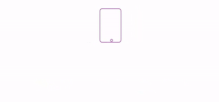
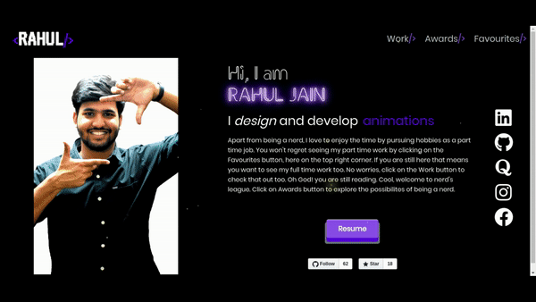

<p align="center"><a href="https://github.com/rahuldkjain/minimal-portfolio"></a></p>
<h1 align="center">:muscle: Awesome Personal Portfolio</h1>
<p align="center">The minimal, responsive and easily customisable portfolio for developers.</p>
<p align="center">


</p>

<p align="center"></p>


## :zap: Pages

:dart: **Home** (Introduction, Skills, Contact me)


:dart: **Work** (Internships, Projects, Miscellaneous Projects)


:dart:  **Achievements And Certifications**
  

:dart: **Favourites** (Movies, TV/ Web Shows)


## 🚀 Getting Started

These instructions will get you a copy of the project up and running on your local machine for development and testing purposes.

You'll need [Git](https://git-scm.com) and [Node.js](https://nodejs.org/en/download/) (which comes with [npm](http://npmjs.com)) installed on your computer.

```
node@v10.16.0 or higher
npm@6.9.0 or higher
git@2.17.1 or higher
```

## 🔧 How To Use 

From your command line, clone and run minimal-portfolio:

```bash
# Clone this repository
$ git clone https://github.com/rahuldkjain/minimal-portfolio.git

# Go into the repository
$ cd minimal-portfolio

# Install dependencies
$ npm install

# Run 
$ npm run dev

```

## 🛠️ Customize
If you like the portfolio and want to use it to create your own, please refer [customization manual.](./CUSTOMIZE.md) 


## :technologist: Technologies used

- [Vuejs](https://vuejs.org/)
- [SCSS](https://sass-lang.com/documentation/syntax) 
- [vue-fontawesome](https://github.com/FortAwesome/vue-fontawesome) for icons
- [octicons](https://github.com/primer/octicons) for github icons
- [graphql](https://graphql.org/)
- [vue-appollo](https://github.com/vuejs/vue-apollo)
- [epic-spinners](https://github.com/epicmaxco/epic-spinners) for spinner
- [v-lazy-image](https://github.com/alexjoverm/v-lazy-image) for lazy loading of images
## 📄 License

This project is licensed under the GPL-3.0 License - see the [LICENSE.md](./LICENSE) file for details


## For the Future 
If you want to **contribute** and make this much better for developers, pleae have a look at [Contributing Manual](./CONTRIBUTING.md) to understand the contribution steps properly.

If you can help us with these. Please don't hesitate to open a [pull request](https://github.com/rahuldkjain/minimal-portfolio/pulls).

- Customisable Color Scheme feature
- Add More Sections

If you created something awesome and want to contribute then feel free to open Please don't hesitate to open an [pull request](https://github.com/rahuldkjain/minimal-portfolio/pulls).

Designed & Developed with :hearts: by [Rahul Jain](https://github.com/rahuldkjain "Rahul Jain")
